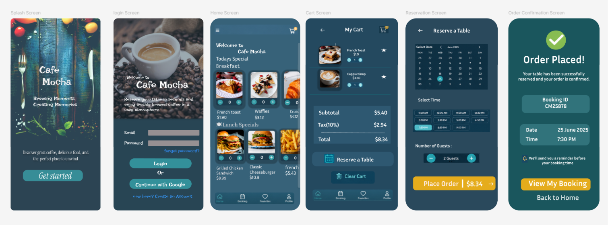

# Cafe Mocha – Appointment Booking Mobile App UI

## Future Interns – UI/UX Design Task 2 (2026)

### Project Overview

This project presents a mobile-first appointment booking application designed for a local café called **Cafe Mocha**. The application enables customers to browse the menu, add food items to their cart, reserve a table, choose a preferred date and time, and receive an instant booking confirmation.

The objective is to simplify the booking experience while reducing scheduling conflicts and improving customer satisfaction.

---

## Business Type

Local Café – Cafe Mocha

---
## Booking Flow

Login → Browse Menu → Add Items → Cart → Reserve Table → Select Date & Time → Place Order → Booking Confirmation

---

## UX Decisions

* Mobile-first interface for comfortable one-handed use.
* Large buttons and clear navigation improve accessibility.
* Minimal booking steps reduce user effort.
* Consistent colours and typography create a professional appearance.
* Instant confirmation provides users with confidence that their reservation is successful.

  

## Problem Statement

Many local cafés still rely on phone calls, WhatsApp messages, or handwritten registers to manage reservations. These traditional methods often result in:

* Missed reservations
* Scheduling conflicts
* Long waiting times
* Poor customer experience
* Loss of potential revenue

---

## Proposed Solution

The proposed mobile application provides a digital appointment booking system where customers can:

* Browse food categories
* Add menu items to their cart
* Reserve a table
* Select their preferred date and time
* Confirm their booking instantly

---

## Target Users

* Students
* Families
* Working professionals
* Tourists
* Coffee lovers
* Regular café customers

---

  ## Screenshots

### Cafe Mocha UI UX

## User Flow

1. Splash Screen
2. Login
3. Home
4. Add Items to Cart
5. Cart Review
6. Reserve Table
   Select Date & Time
7. Place Order
8. Booking Confirmation

---

## Screens Designed

* Splash Screen
* Login Screen
* Home Screen
* Cart Screen
* Table Reservation Screen
* Order Confirmation Screen

---

## UX Decisions

* Simple navigation for first-time users
* Large touch-friendly buttons
* Clean and consistent colour palette
* Minimal booking steps to reduce friction
* Easy-to-read typography
* Clear booking confirmation

---

## Tools Used

* Figma

---

## Outcome

This design demonstrates a practical appointment booking solution that improves customer convenience while helping café owners manage reservations more efficiently.

---

## Author

**Arunima Manilal**

Computer Science Engineering Student

Future Interns UI/UX Design Internship – 2026
